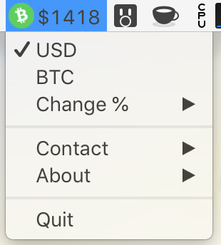
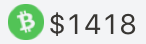
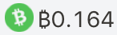
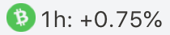
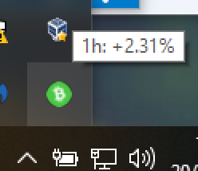

# Cashbar
[]()
[](http://commitizen.github.io/cz-cli/)


Cashbar is a simple application designed to give you quick access to Bitcoin Cash prices from you desktop



It will show prices in either USD/BCH...



...BTC/BCH....



...or a change percentage over 1hr, 24hrs or 7days.



Windows support is also available. Due to OS limitations, I can only display prices while hovering over the icon:



## Installation

macOS: Download the latest .DMG from the releases page [here.](https://github.com/johneas10/cashbar/releases)
Then open it up and drag the app to applications folder.

Windows: Download the latest .EXE from the releases page [here](https://github.com/johneas10/cashbar/releases) and run the installer.

## Development setup

#### Prerequisites:
  The following instructions assume you:
  - have nodejs & NPM installed. Download and install the latest LTS Installer from [here](https://nodejs.org/en/download/) if you don't.

Open up your terminal app and clone the repository:
```
git clone git@github.com:johneas10/cashbar
```
Install the dependencies
```sh
npm install
```
To run the locally built version, run:
```sh
npm start
```
There other development scripts available in `package.json`

## Built With
- [Electron](https://electronjs.org/)
- [CoinMarketCap API](https://coinmarketcap.com/api/)


## Contributing

1. Fork it (<https://github.com/johneas10/cashbar/fork>)
2. Create your feature branch (`git checkout -b feature/BCHPLZ`)
3. Commit your changes (`git commit -am 'Add some BCHPLZ'`).
4. Push to the branch (`git push origin feature/BCHPLZ`)
5. Create a new Pull Request against the Master branch.
